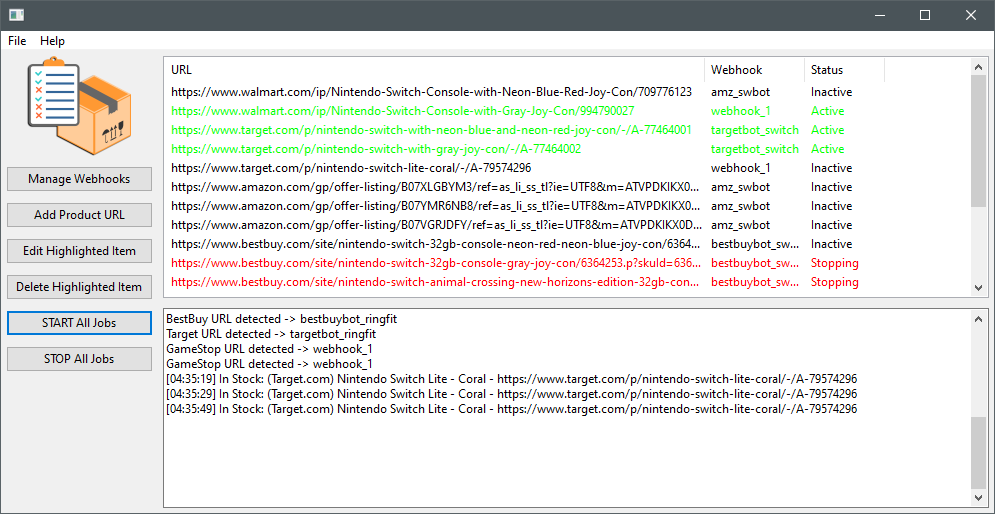

# Get webhook notifications when products come in stock. 

### Supports

- Amazon (specific offer-page listings only, more in the notes section at bottom)
- Gamestop (very slow to refresh in selenium in my tests)
- Target
- BestBuy
- B&H Photo/Video
- Walmart (requires a waiting period between page loads or a rotating proxy (not supported within the script) to get accurate stock results)
  - New for Walmart links: MAX PRICE. You can set a threshold so you won't be notified if the in-stock product comes in above that number. Useful since Walmart has marketplace sellers with higher-than MSRP.
    - edit `gui.py` in a Text Editor and change `maxprice = 0` to `maxprice = 300` (at the top section of the script) and then you won't receive walmart notifications for anything above 300

### Requirements:

- Webhook URLs (Currently supports discord out of the box. [Get a discord webhook URL](https://support.discordapp.com/hc/en-us/articles/228383668-Intro-to-Webhooks))
- Python 3
- `pip install requests` (should already be installed if you used Bird Bot)
- `pip install wxpython` (GUI library for the URL and Webhook manager wrappers)
- `pip install selenium` (Right now used for Amazon/Gamestop links)
- `pip install chromedriver-py==81.0.4044.69` (Used with selenium)
- `pip install lxml`

To speed this up, just run `pip install -r requirements.txt`
(if pip does not work try pip3)

If you used birdbot you should already have these installed, aside from wxpython which you will still need to install.

### BETA Gui for Windows.

- Not working on Mac
- Not tested on Linux



Run `python gui.py` to use the beta GUI. 

All functionality remains in app.py which is covered below.

# How To Use

Simply `git clone` or download ZIP of this repository and navigate to the root of "product-checker-master".

Execute `python app.py`

When you launch the script you will be given a menu:

```
Select an Option: 
 1: Edit Webhooks
 2: Edit Product URLs
 3: Run the product tracker

Enter # (1-3)
```

There are now GUI wrappers for managing Webhook URLs and Product URLs. Hit either 1 or 2 to manage those.

- First, you need to edit webhooks to add your Webhook URLs and give them friendly names.
- Then, you need to edit product URLs to add products to track and assign them a webhook destination via friendly name.

You don't need more than one webhook URL, but this is useful if you are tracking multiple products, you can streamline your notifications so you can mute certain channels when you don't want to get notifications about their stock but still want the script to run it.

## Adding Webhooks:

Use option 1 to open the webhook editor. Webhooks are actually stored in `/data/webhooks.json`


Assign a friendly name to the webhook like "webhook_1" or "switch_webhook" that you will be able to recognize in the next step.

## Adding URLs:

Use option 2 to open the URL editor. URLs are actually stored in `/data/products.json`


Make sure to select your newly-added URL and choose "configure" to assign a webhook destination, otherwise you will not receive any notifications.

You can assign more than one url to a webhook, so for example send all nintendo switch links to webhook_1, and then send an oculus rift link to webhook_2. You could split it up by product or by site, or just have them all go to the same webhook.


## Finally:

Run the script with option 3 and watch the console/watch for discord notifications


Sample discord output:


# Notes:

Remember: This code is not perfect, there will be bugs, glitches, and unhandled exceptions, but if you do everything as you should, with proper URLs and assigning them to webhook destinations, your chances of running into an unhandled exception are slim.

The amazon offer pages must show no other listings for the script to trigger appropriately. There are some links floating around that show 0 stock until it's being sold by amazon at MSRP. These are the links you want to use here. You can not use product page links, the script will reject those. And if you use offers page links with marketplace sellers, the script will trigger an "in stock" status because it can see those listings.

There will always be a delay after each walmart link but I am not perfect and may not have chosen an approriate delay. Remember, at Walmart, if you load pages too quickly the stock is automatically considered out of stock and you will not receive a notification even if it comes in stock. The other solution is a rotating proxy which I have not implemented yet.

The script now uses multi-threading, so each URL has its own task and runs in its own thread with its own timer. This means slow/stuck URLs will not impede other URLs ability to load, and additionally you can define different timers for each URL type (if you want to refresh target every 15 seconds but best buy every 20 seconds, for example.)

## False Notifications?

These will usually be regional-based store pickups or actual checkout bots buying everything before you're able to. IF you don't see it in stock but are constantly getting notifications (every minute or two) then it's likely being stocked for store pickup somewhere and you should check if there is anywhere around you that has it available.
